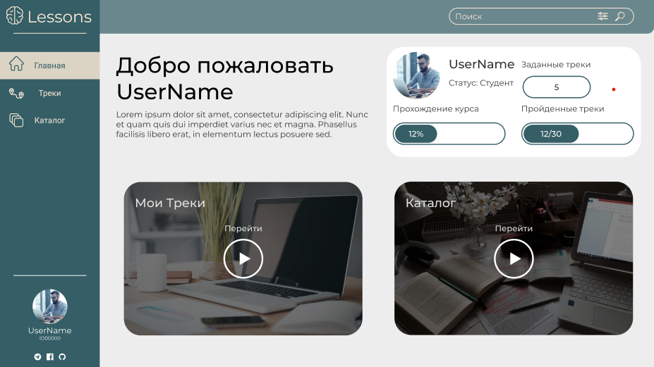
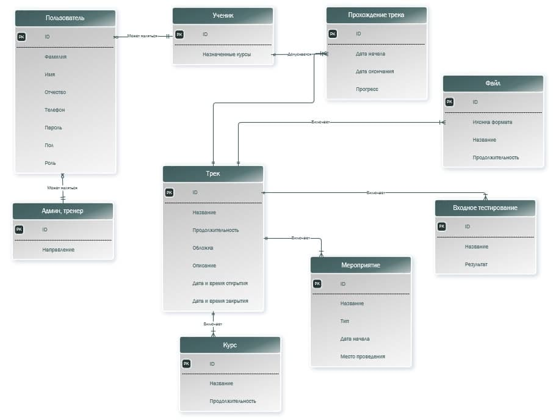
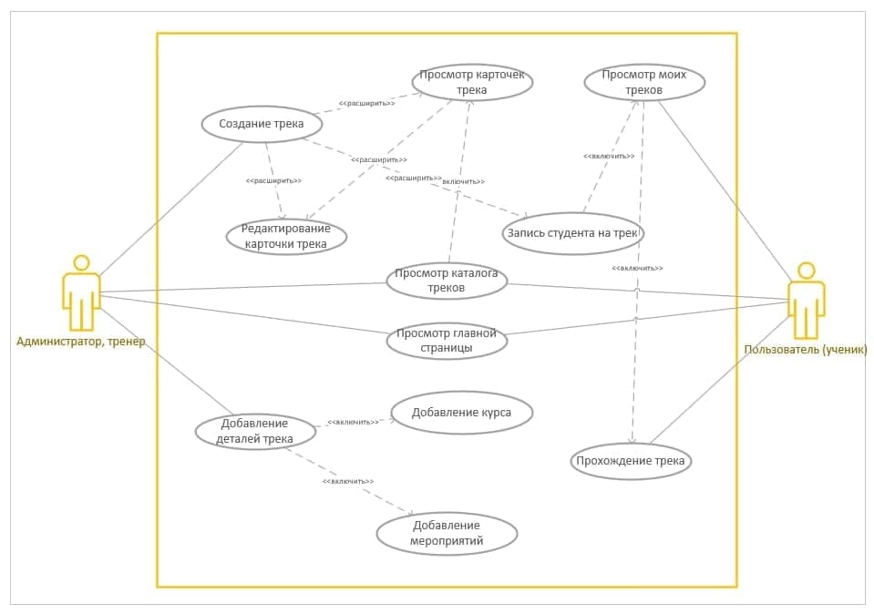

# Web_CASELab TEAM 1
GreenATOM

***
_Компанией GreenATOM проводиться Кейс-лаборатория с целью отобрать перспективных участников, для дальнейшего трудоустройства в [их компании](https://greenatom.ru/)._

***
### Наша комманда
* [Лиза](https://github.com/handlessdude)
* [Егор](https://github.com/mucholocobbb)
* [Марина](https://github.com/Vorobeva-Marina)
* [Дарья](https://github.com/DariaZubkova)
* [Полина](https://github.com/ZaripovaPA)
* [Денис](https://github.com/DenisLisko)
***
### Для чего мы тут
_Ключевым условием участия в Кейс-Лаборатории является работа в комманде. Участники должны согласовать рабочее время, распределить роли и задачи внутри комманды. Успех прохождения Кейс-Лаборатории является слаженная командная работа и четкое выполнение поставленной задачи_
***
### Что мы разрабатываем
_Задачей Кейс-Лаборатории является создание веб приложения для прохождения онлайн курсов._

***
### Дизайн
_Дизайн создавался по принципам UX/UI, т.е. принципам пользовательского интерфейса. Создание интерфейса это один из важных этапов, поэтому мы подошли к разработке очень ответственно и достаточно большое время потратили на его реализацию. В процессе работы над дизайном мы старались сделать его простым и понятным для обычного пользователя, опираясь на предоставленное техническое задание. 
В процессе разработки мы анализировали юзабилити приложения и разработчики уже исправляли страницы при верстке._

[Ссылка на дизайн](https://www.figma.com/file/ph54rMWyMQQ7P0PLgQphs0/CLW_T1_Design?node-id=4%3A70)
***
### ER-диаграмма

***
### Use Case

***
### Test Case

